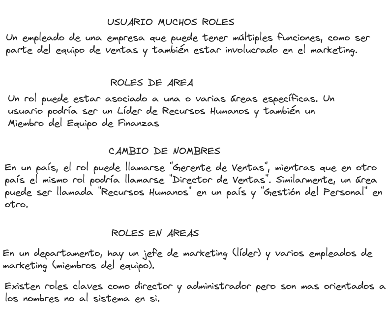
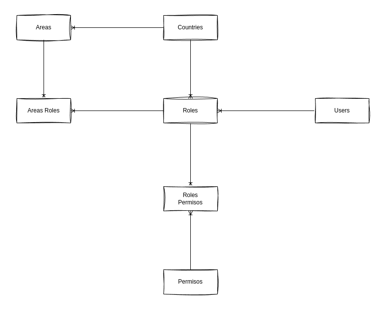

# Refactor-Django
Refactor Users Roles


## Analisis





## ORM

### Usuarios de varios roles
user = User.objects.create(username='juan.bermoe')
sales_manager_role = Role.objects.create(name='Gerente de Ventas', country=usa)
project_leader_role = Role.objects.create(name='Líder de Proyecto', country=usa)

user.roles.add(sales_manager_role)
user.roles.add(project_leader_role)

### Asignar roles
sales_area = Area.objects.create(name='Ventas', country=usa)
sales_leader_role = Role.objects.create(name='Líder de Ventas', country=usa)
sales_team_member_role = Role.objects.create(name='Miembro del Equipo de Ventas', country=usa)

RoleArea.objects.create(role=sales_leader_role, area=sales_area, is_leader=True)
RoleArea.objects.create(role=sales_team_member_role, area=sales_area, is_leader=False)

### Se sabe si es un lider o un miembro
RoleArea.objects.create(role=leader_role, area=marketing_area, is_leader=True)
RoleArea.objects.create(role=team_member_role, area=marketing_area, is_leader=False)

### Se define roles claves
director_role = Role.objects.create(name="Director", country=usa, is_clave_role=True)
admin_role = Role.objects.create(name="Administrador", country=usa, is_clave_role=True)

### Nombres de variables
usa = Country.objects.create(name='USA', code='US')
mexico = Country.objects.create(name='México', code='MX')

sales_area_usa = Area.objects.create(name='Ventas', country=usa)
sales_area_mexico = Area.objects.create(name='Comercialización', country=mexico)


## Testing de la solucion

Dentro de la carpeta Test

```bash
❯ py roles/manage.py test users
Found 2 test(s).
Creating test database for alias 'default'...
System check identified no issues (0 silenced).
..
----------------------------------------------------------------------
Ran 2 tests in 0.397s

OK

Destroying test database for alias 'default'...
```


